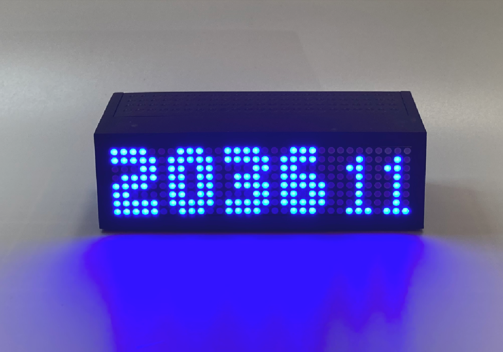
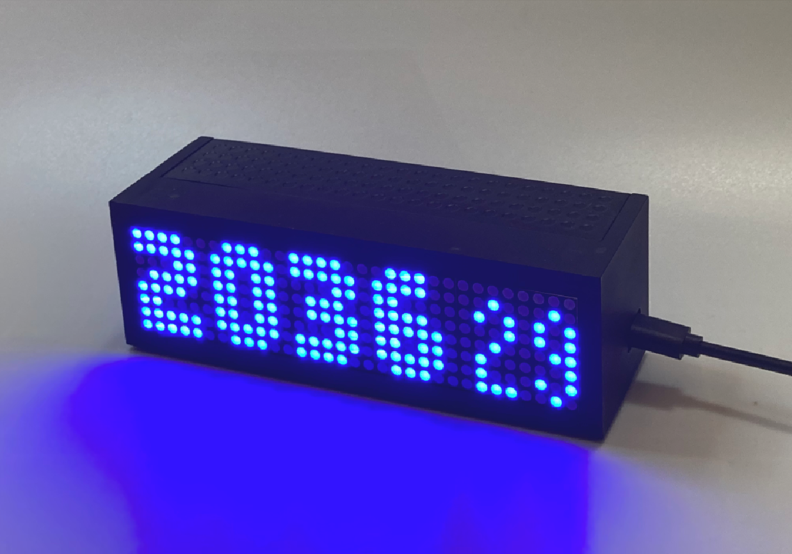

{:width="111px" style="float: right;"}

The **Digital Satellite Clock** is a simple, easy-to-use, autonomous clock. What makes this clock "autonomous" is that you never need to set the time &mdash; you simply turn it on and it will display the current time using signals received from global navigation satellite system (GNSS) satellites that are orbiting the earth. Plus, the clock contains an internal rechargable battery so that it can operate for extended periods when the external power goes out. The clock can be ordered with a `Blue` `Red` or `Green` digital LED matrix display.

{:width="100%" style="align: center; border-radius: 10px; border: 6px solid #bbb;"}

**UTC time** ([Coordinated Universal Time](https://en.wikipedia.org/wiki/Coordinated_Universal_Time)) is displayed in 24-hour format by default on the clock, unless it was ordered with custom time zone and/or daylight savings time settings (_I can make you a custom version of the clock if you specify this option when ordering from the [Tindie Store](https://www.tindie.com/products/cpknight/digital-satellite-clock/)_).

### Image Gallery:

|  |  |  |
|  |  |  |
|  |  |  |

### Details and Documentation:

- Download the: [**Quick Reference Card** and **Important Safety Information**](PN-YONNE-000-40.pdf) (PDF)

- Dimensions: **14cm x 4.5cm x 4.5cm** (L x W x H)
- Weight: **260g** (on Earth)
- Input Power: **DC 5V 1.0A** (via USB-style connector)
	- _Note: a connector cable is provided with the clock; a 5V power supply is not included._  
  
  
- Online Ordering: **[Tindie Store](https://www.tindie.com/products/cpknight/digital-satellite-clock/)**

### FAQ and Troubleshooting:

- **What happens when I turn on the clock the first time?** The first time you power on the clock after a period of inactivity the device may take up to 15 minutes or more to acquire a reliable GNSS signal. For best reception place the clock in an area with a clear view of the sky.  

- **What is that two-letter/number code I see when the clock starts up?** The two-digit code that appears after "**dSC**" at startup is a hexidecimal number that refers to the firmware revision that is loaded into the clock. You don't really need to worry about this, but it may be useful in the event that you need to [contact me](mailto:chris@cpknight.io) when troubleshooting with the device.  

- **What is that strange symbol I see when the clock starts up?** This is showing you the number of GNSS satellites that the clock is currently tracking and receiving signals from. Normally you'll only see `x 0-` indicating that there is no lock whatsoever because as soon as the first GNSS signal is received, the clock will start displaying the time.  

- **Sometimes the seconds display on my clock "blanks" out for a second or two. What is going on?** When the seconds display "stutters" like this, your clock is indicating that it is having problems receiving reliable GNSS signals for more than a second. Your clock will normally be tracking multiple satellites at once, but as different satellites come and go out of view (and their signals degrade), it may take a moment or two for a good GNSS signal to be re-acquired. _See the notes below about acquiring a GNSS signal for more information._  

- **Can I move the clock without affecting its accuracy, for example, while driving in my car?** Yes! GNSS signals are all, essentially, time signals which is how a GNSS device will determine your position using math and stuff. While this clock isn't intended to display your position, it will work just like any other GNSS receiver device and can move around just fine while still telling you the time accurately. There is one caveat, however: due to limitations in consumer GNSS technology, if you're moving around _really, really fast_ or if you're _really, really high_ in the air (ie. above 1200MPH or 60,000' above sea level) then the GNSS receiver is not going to work. This is to prevent you from using the technology in your clock for nefarious purposes (please and thank-you).  

- **How long does the battery backup last?** The internal battery is intended to serve as a backup power source. Use the included USB-style cable to power it from a +5V DC power supply. When disconnected from power, the device can display time for up to 8 hours. When connected to power, the battery will automatically recharge regardless of whether the clock is switched on or off.  

- **My clock is taking a really long time to acquire a GNSS signal and display the time - what can I do?**
	- When a GNSS (Global Navigation Satellite System) receiver is turned on for the first time after a period of inactivity, it may take a long time to acquire GNSS signals and establish an accurate position. This delay can be attributed to several factors such as _signal acquisition_ and _signal strength and interference_ factors:  

		- _Signal Acquisition_: The receiver needs to detect and track the signals from multiple satellites. This process involves searching for the satellite signals in the local environment, estimating the signal parameters, and then acquiring the signals. The more satellites the receiver can detect and track, the more accurate the position will be.  

		- _Signal Strength and Interference_: The strength of the GNSS signals can be affected by various factors, such as the receiver's location, the local environment, and atmospheric conditions. If the signal strength is low due to these factors, it can take longer for the receiver to acquire the signals. Additionally, interference from other electronic devices or radio signals can also impact the receiver's ability to acquire GNSS signals.  

	- Here are some tips to speed up the process of acquiring GNSS signals:  

		- _Clear Sky View_: Ensure that the receiver has a clear view of the sky, as obstructions such as buildings or trees can block or weaken GNSS signals (if you're having trouble getting a signal at your desk, for example, put it by the window for a while until you have a time signal, and then it can usually be placed back at your desk thereafter).  

		- _Power Cycle the Receiver_: If the receiver is taking a long time to acquire signals, try turning it off and then on again. This can reset the receiver's internal algorithms and may speed up the acquisition process.  

		- _Be Patient_: Sometimes, it simply takes time for the receiver to acquire GNSS signals, especially if it has been inactive for a long period or has moved a significant distance since its last use. In such cases, the best course of action is to be patient and give the receiver enough time to acquire the necessary signals.  
  

- **My internal battery doesn't last 8 hours, what do I do?** Over time, Lithium Polymer (LiPo) batteries are expected to experience performance degradation due to a variety of factors. These include changes in the chemical composition of the battery, mechanical stress, and environmental conditions. The chemical reactions within the battery, particularly the formation of the Solid Electrolyte Interphase (SEI) layer, increase the internal resistance of the battery, leading to a decrease in capacity and increased self-discharge over time.

	- The performance of a LiPo battery can be influenced by several factors. For instance, the Global Navigation Satellite System (GNSS) signal strength can impact battery performance because the GNSS receiver in a device requires a certain amount of power to maintain a connection to the satellite signals. If the GNSS signal is weak, the receiver may consume more power to maintain the connection, which can drain the battery more quickly.  

	- LED matrix color choice can also affect battery performance. The brightness and color of LEDs can influence the power consumption of the device. For example, brighter and white LEDs generally consume more power than dimmer and colored LEDs. Choosing the appropriate color and brightness for the LED matrix can help optimize battery performance.  

	- Other factors, such as temperature, discharge rate, and the number of charge-discharge cycles, can also impact the battery's performance. High temperatures can accelerate the degradation of the battery, while high discharge rates can lead to a decrease in capacity.  

	- As the device is intended to be powered primarily by a 5V power supply, the LiPo battery should only be used as a backup power source. This will help to extend the battery's lifespan by reducing the number of charge-discharge cycles and minimizing the impact of other factors that can degrade battery performance.  
  

- **I'd like to replace some of the parts inside, and/or program my own firmware for this clock. How do I do that?** You can't really &mdash; this device is not intended to have any user-servicable parts, and the USB-style connector on the side is for power purposes (ie. recharging the battery) only. With that said, if you're willing to void the warranty on the device, you _might_ be able to pry it open and do a little hacking. I quite like hacking devices myself, so if you're really wanting to do this, then please [contact me](mailto:chris@cpknight.io) and I'd be happy to help you out with some more details, notes, etc. There is a LiPo battery in there, however, so please be careful, though and any disassembly, modifications, hacks, etc. are entirely at your own risk!  
  
  
### Limited Warranty:

**Two (2) Year Limited Warranty**: @cpknight warrants this product to be free from defects in workmanship and material for a period of two years from date of purchase and will repair or replace units found to be defective at our discretion. This warranty does not cover damage through accident, misue, intentional disassembly, or modification. For any concerns, please [contact us](mailto:chris@cpknight.io) for information and troubleshooting tips. Should this product require replacement (at our option) while under warranty, please pack the item and return it prepaid, along with store receiipt showing date of purchase to:

> CPKNIGHT TECH  
> 400 - 909 17 AVE SW  
> CALGARY AB  T2T 0A4  
> CANADA  

- There are no express warranties except as listed above. 
